# Kafka Real-Time Air Quality Analyzer

Система мониторинга качества воздуха в реальном времени с использованием Apache Kafka, React и PostgreSQL.

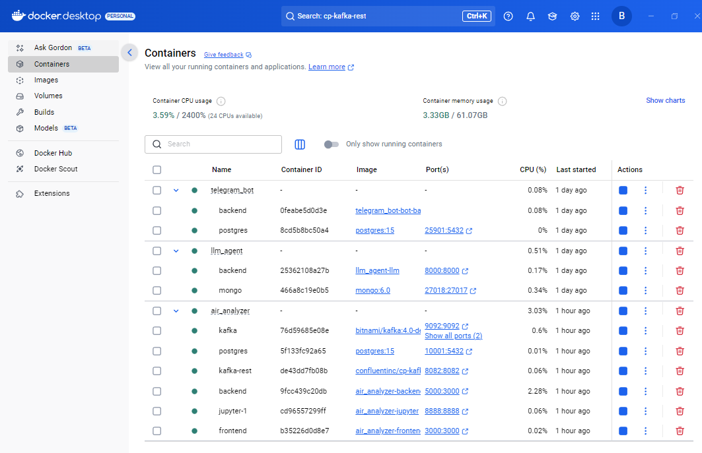
*Docker сервисы проекта, включая air_analyzer, postgres и kafka*

## Цель проекта

Данный проект направлен на исследование и доказательство гипотезы о необходимости улучшения системы вентиляции в учебных аудиториях. Основная цель - показать корреляцию между качеством воздуха и эффективностью обучения студентов.

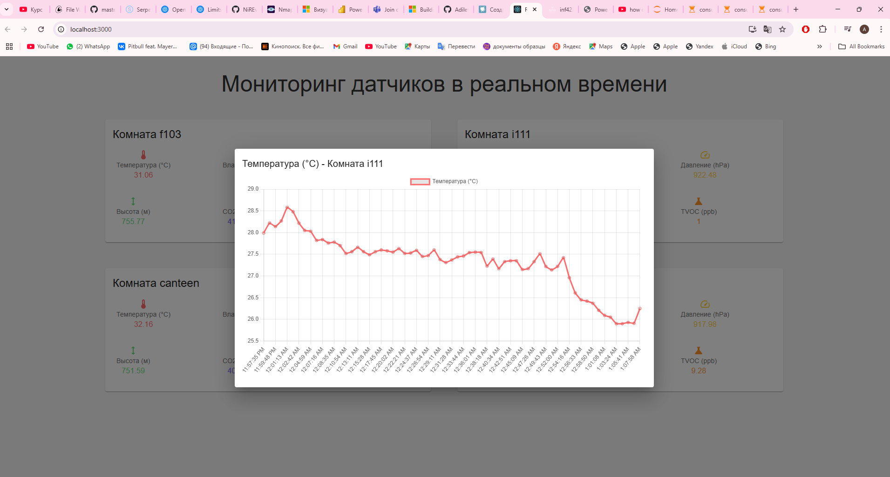
*Панель мониторинга качества воздуха с показателями температуры, CO2, давления и других параметров*

### Исследовательские задачи:
- Сбор и анализ данных о качестве воздуха в различных учебных помещениях
- Выявление закономерностей между уровнем CO2 и другими показателями качества воздуха
- Документирование влияния плохой вентиляции на учебную среду
- Предоставление доказательной базы для модернизации системы вентиляции

### Ожидаемые результаты:
- Научное обоснование необходимости улучшения вентиляции
- Статистические данные о качестве воздуха в течение учебного дня
- Рекомендации по оптимизации учебной среды

## Архитектура проекта

- **Frontend**: React приложение для визуализации данных
- **Backend**: Node.js + Express сервер для обработки данных из Kafka
- **Kafka**: Система обработки потоков данных в реальном времени
- **PostgreSQL**: База данных для хранения исторических данных
- **Jupyter**: Ноутбук для анализа данных и тестирования
- **ESP32**: Микроконтроллер для сбора данных с сенсоров

## Структура проекта

```
.
├── kafka_react_app/
│   ├── frontend/         # React приложение
│   └── backend/          # Node.js сервер
├── myjupyter/           # Jupyter ноутбуки
├── esp32/               # Код для ESP32
├── postgres/            # SQL скрипты и конфигурация PostgreSQL
└── docker-compose.yml   # Docker конфигурация
```

## Компоненты системы

### Kafka
- **Порты**: 9092 (внутренний), 9093 (контроллер)
- **Топики**: f103, i111, canteen, hall
- **Kafka REST**: Порт 8082


*История изменений в репозитории проекта*

### База данных
- **PostgreSQL 15**
- **Порт**: 10001
- **Credentials**:
  - User: user
  - Password: root
  - Database: postgres

### Веб-приложение
- **Frontend**: http://localhost:3000
- **Backend API**: http://localhost:5000
- **Jupyter**: http://localhost:8888

## Запуск проекта

1. Сборка и запуск всех сервисов:
```sh
docker-compose up -d
```

2. Проверка работы Kafka:
```sh
docker exec -it kafka bash
cd opt/bitnami/kafka/bin/
kafka-console-consumer.sh --bootstrap-server localhost:9093 --topic f103 --from-beginning
```

## Требования

- Docker
- Docker Compose
- Node.js (для локальной разработки)
- Python (для работы с Jupyter)

## Мониторинг

Система позволяет отслеживать следующие параметры качества воздуха:
- Температура
- Влажность
- Уровень CO2
- Качество воздуха (VOC)

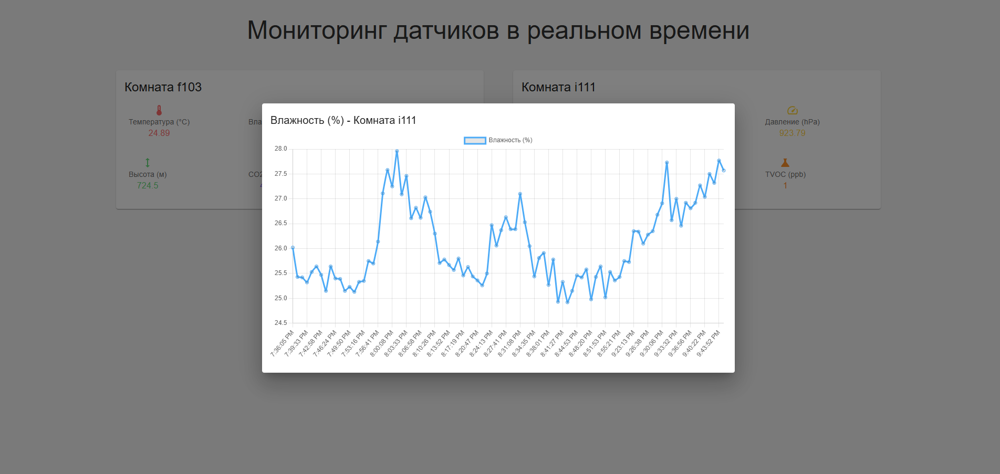
*График изменения температуры в реальном времени*

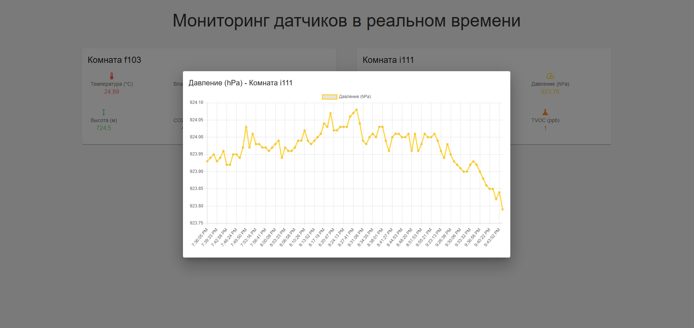
*График изменения влажности в реальном времени*

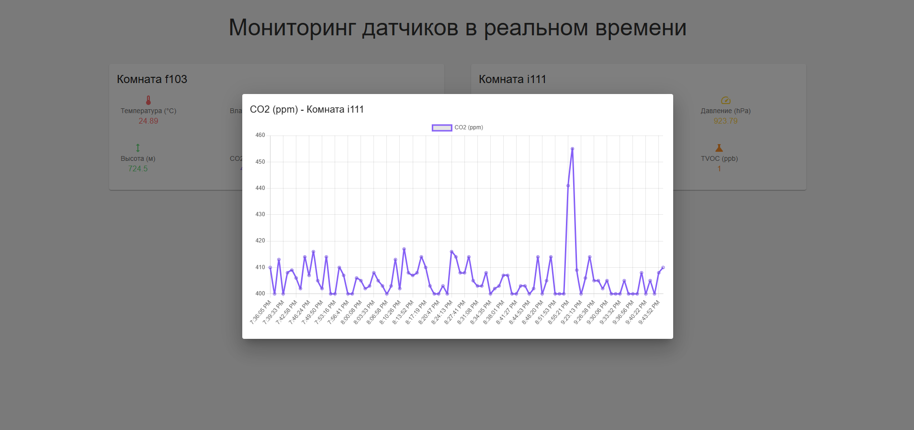
*График атмосферного давления в реальном времени*

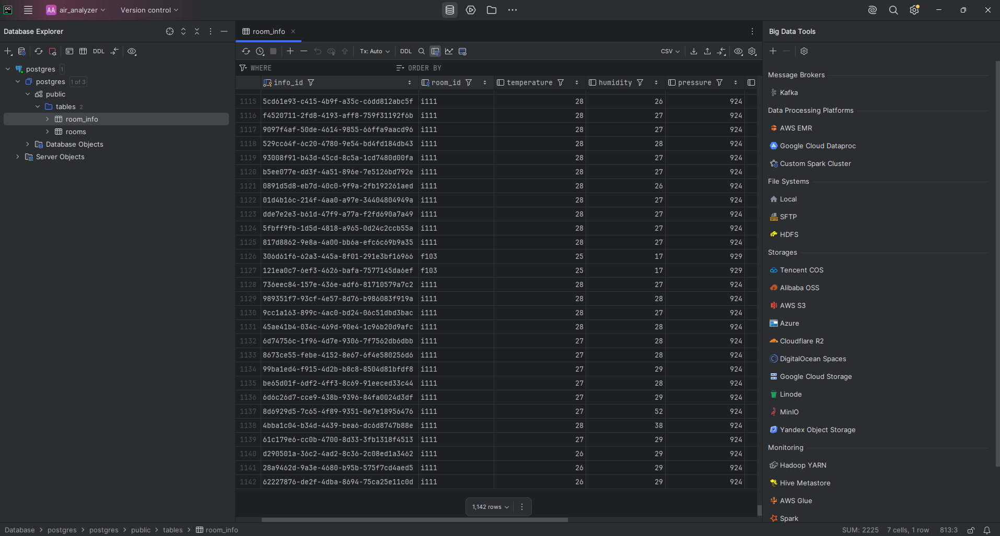
*График концентрации CO2 в реальном времени*

### Визуализация данных

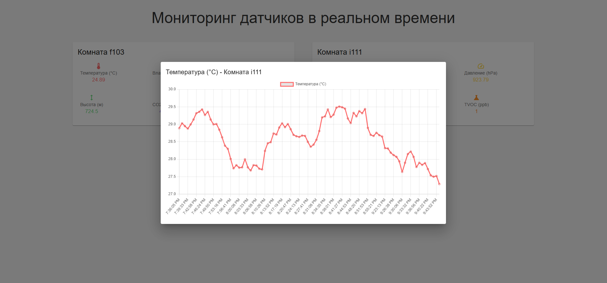
*Панель мониторинга с данными различных помещений в реальном времени*

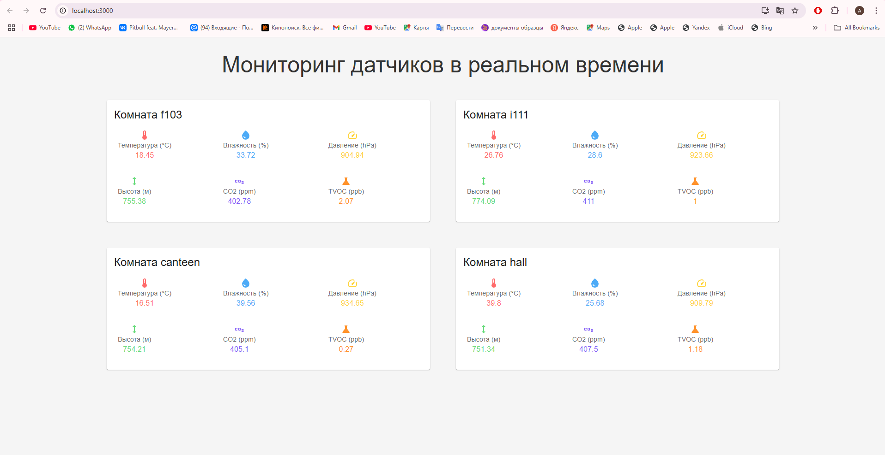
*Визуализация данных в Power BI с информацией о помещениях*

### Система видеонаблюдения

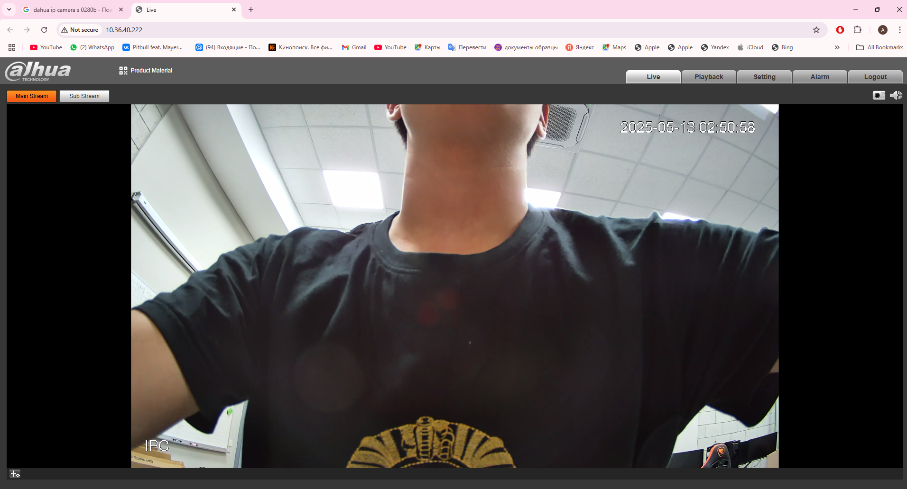
*IP-камера Dahua для мониторинга помещений*

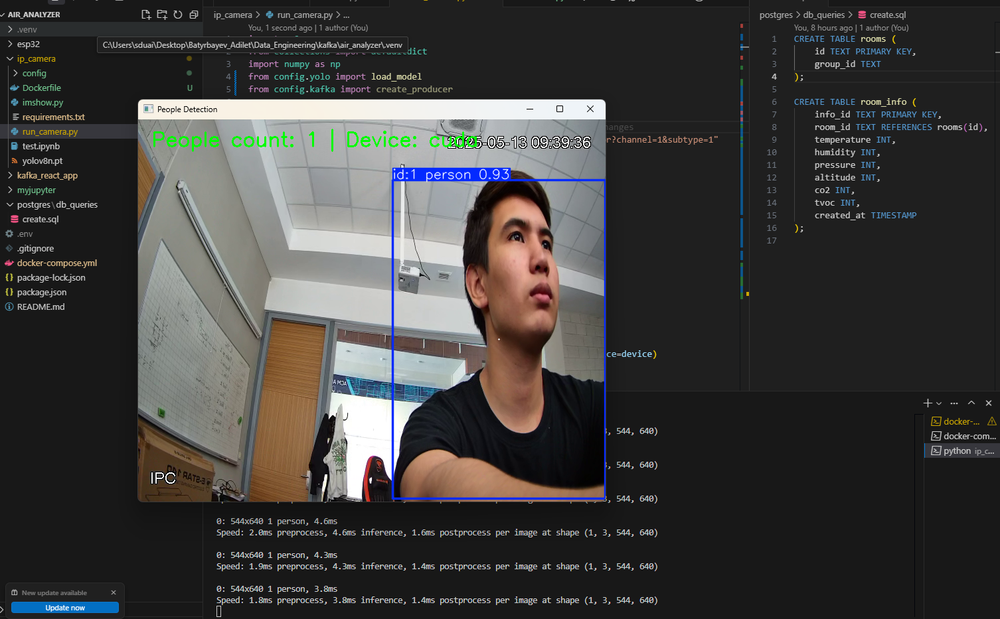
*Система подсчета людей с использованием CUDA*

## Источник

Проект основан на [Seeed Studio Wiki](https://wiki.seeedstudio.com/xiao_esp32c6_kafka/) с существенными модификациями и улучшениями.

## Процесс сбора и обработки данных

### Сбор данных
1. **Сенсоры ESP32**:
   - Измерение температуры и влажности (BME280)
   - Измерение уровня CO2 (CCS811)
   - Измерение качества воздуха TVOC (CCS811)
   - Частота сбора данных: каждые 70 секунд

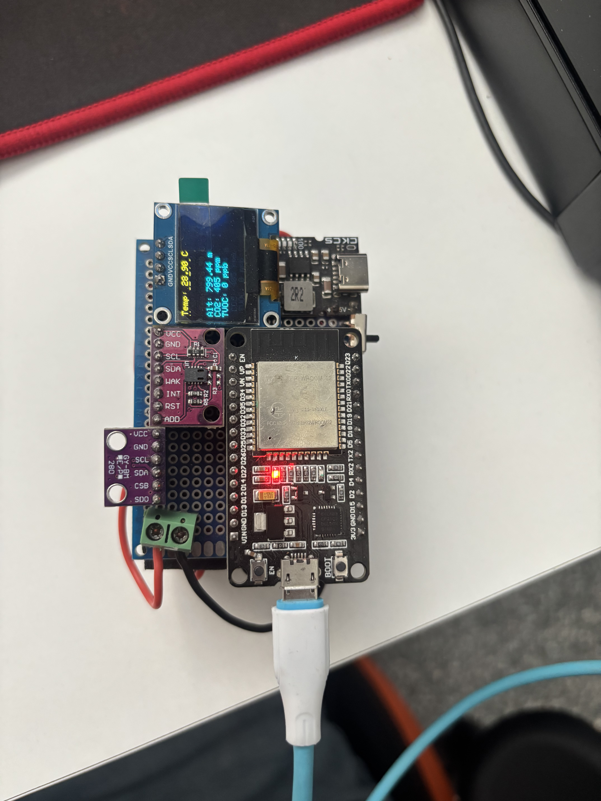
*Контроллер ESP32 с подключенными сенсорами для сбора данных о качестве воздуха*

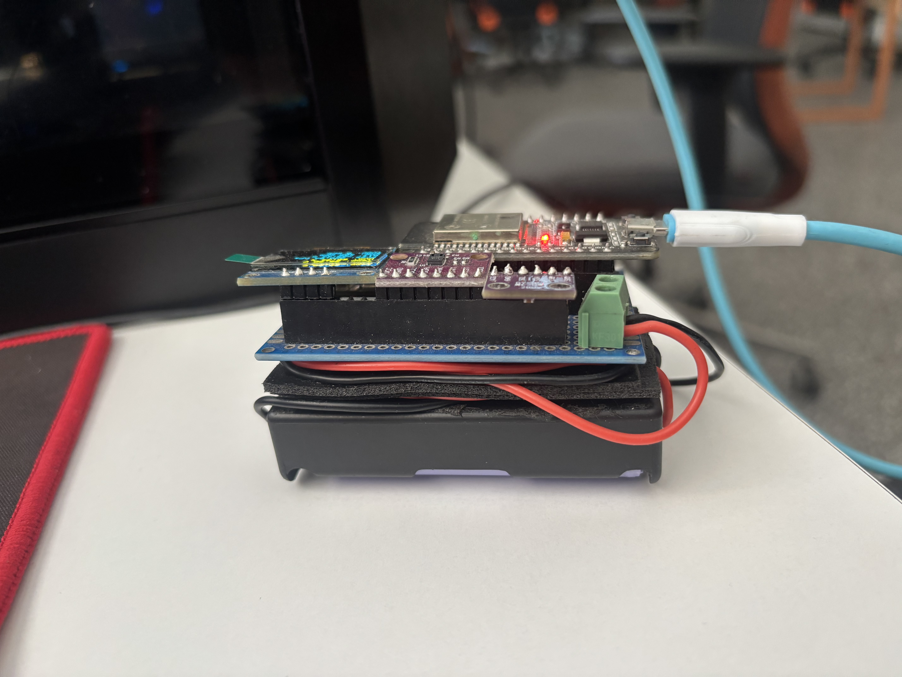
*Установленный контроллер ESP32 в рабочем состоянии*

2. **Формат данных JSON**:
```json
{
    "sensor_id": "f103",
    "timestamp": "2024-03-20T10:30:00Z",
    "measurements": {
        "temperature": 23.5,
        "humidity": 65.2,
        "co2": 700,
        "tvoc": 150
    },
    "metadata": {
        "room_capacity": 30,
        "current_occupancy": 25,
        "window_status": "closed"
    }
}
```

### Обработка данных
1. **Kafka Producer (ESP32)**:
   - Форматирование данных в JSON
   - Отправка в соответствующий топик Kafka
   - Обработка ошибок передачи

2. **Kafka Consumer (Backend)**:
```javascript
const handleMessage = async (message) => {
    try {
        const data = JSON.parse(message.value);
        
        if (!validateSensorData(data)) {
            logger.error('Invalid sensor data format');
            return;
        }

        if (data.measurements.co2 > 1000) {
            await sendAlert({
                room: data.sensor_id,
                level: 'warning',
                message: 'Высокий уровень CO2'
            });
        }

        await saveToDatabase(data);

        io.emit('sensor-update', data);

    } catch (error) {
        logger.error('Error processing message:', error);
    }
};
```

3. **Анализ данных**:
   - Расчет средних показателей
   - Выявление пиковых значений
   - Корреляционный анализ
   - Генерация отчетов

### Критические пороги:
- **CO2**:
  - Нормальный: < 800 ppm
  - Повышенный: 800-1000 ppm
  - Критический: > 1000 ppm
- **Температура**:
  - Оптимальная: 20-23°C
  - Допустимая: 19-25°C
- **Влажность**:
  - Оптимальная: 40-60%
  - Допустимая: 30-70%

### Хранение данных
1. **Краткосрочное хранение**:
   - Kafka retention: 7 дней
   - In-memory кэш для real-time отображения

2. **Долгосрочное хранение**:
   - PostgreSQL с партиционированием по дате
   - Агрегированные данные для аналитики
   - Бэкапы исторических данных