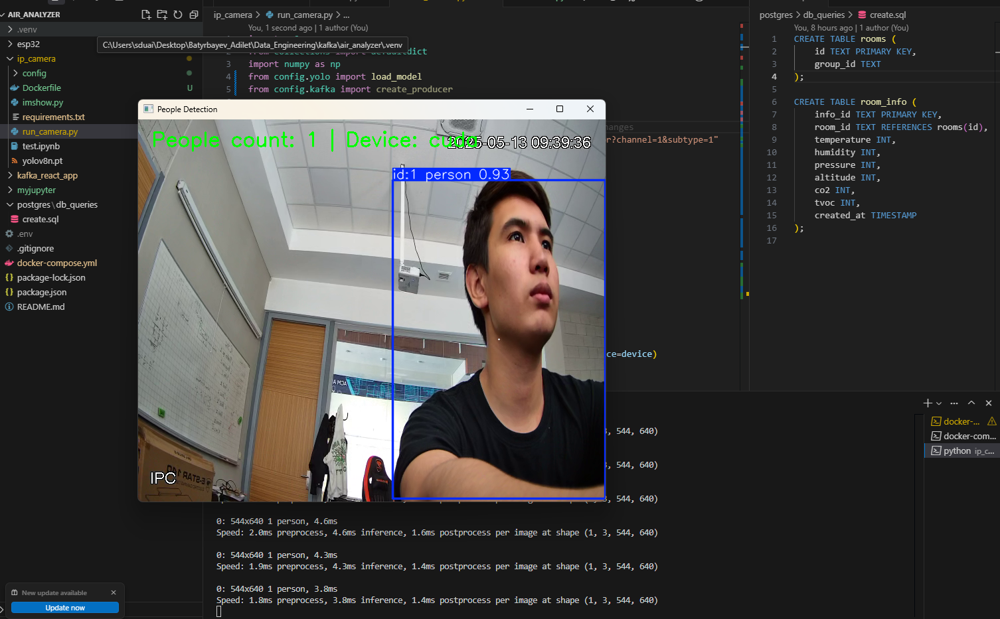
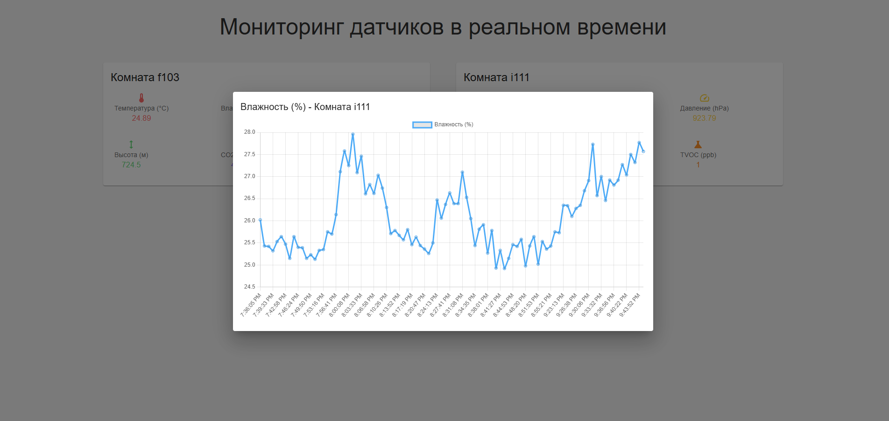
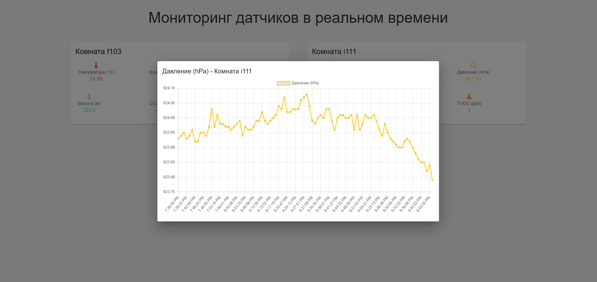
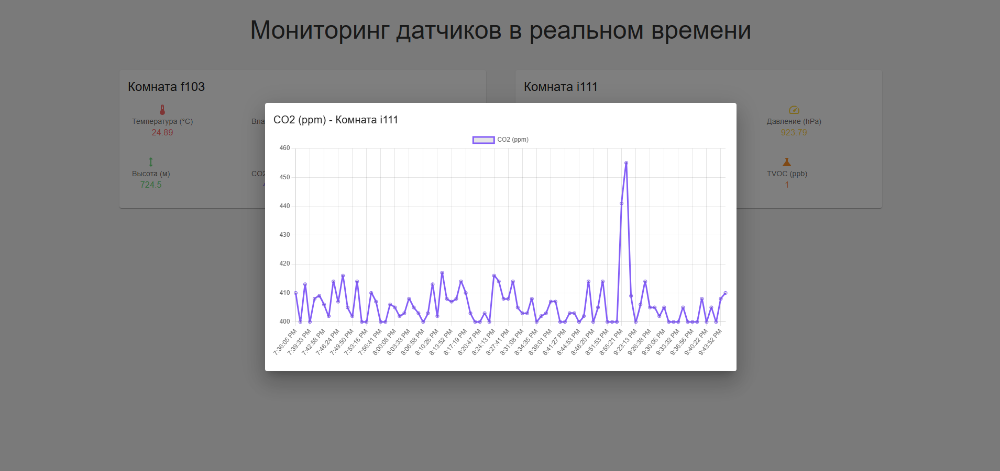
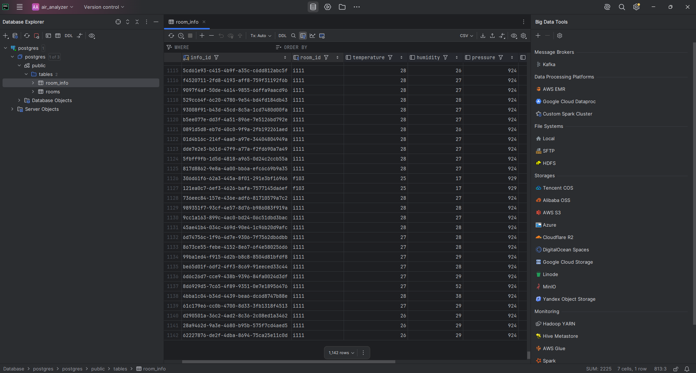
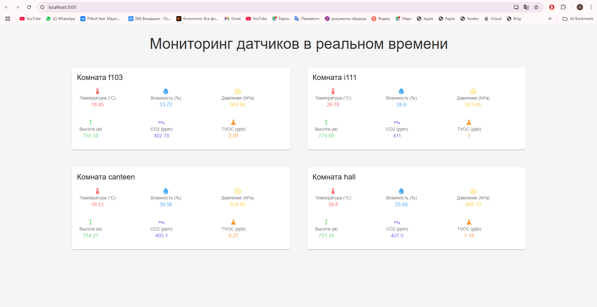
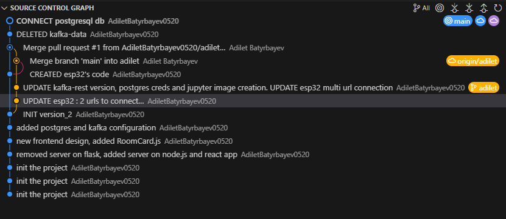

# Отчет по разработке системы мониторинга качества воздуха
#### Автоматизированная система сбора и анализа данных на базе Apache Kafka

## Содержание
1. [Введение](#введение)
2. [Цели и задачи](#цели-и-задачи)
3. [Архитектура системы](#архитектура-системы)
4. [Технические характеристики](#технические-характеристики)
5. [Компоненты системы](#компоненты-системы)
6. [Процесс сбора и обработки данных](#процесс-сбора-и-обработки-данных)
7. [Результаты внедрения](#результаты-внедрения)
8. [Заключение](#заключение)

## Введение

В данном отчете представлена документация по разработке и внедрению автоматизированной системы мониторинга качества воздуха в учебных помещениях. Система разработана с использованием современных технологий обработки данных в реальном времени и предназначена для сбора, анализа и визуализации параметров воздушной среды.


*Рисунок 1. Панель мониторинга качества воздуха с показателями температуры, CO2, давления и других параметров*

## Цели и задачи

### Основная цель проекта
Исследование и документальное подтверждение необходимости модернизации системы вентиляции в учебных аудиториях путем выявления корреляции между качеством воздуха и эффективностью образовательного процесса.

### Исследовательские задачи
1. Организация системы сбора данных о качестве воздуха
2. Проведение анализа полученных показателей
3. Выявление зависимостей между параметрами воздушной среды
4. Формирование доказательной базы для модернизации вентиляционных систем

## Архитектура системы

Система построена на основе микросервисной архитектуры с использованием следующих компонентов:


*Рисунок 2. Структура Docker-сервисов системы*

### Основные компоненты:
- Фронтенд-приложение (React)
- Бэкенд-сервер (Node.js + Express)
- Система обработки потоков данных (Apache Kafka)
- База данных (PostgreSQL)
- Аналитический модуль (Jupyter Notebook)
- Микроконтроллер сбора данных (ESP32)

## Технические характеристики

### Аппаратное обеспечение


*Рисунок 3. Контроллер ESP32 с подключенными сенсорами*


*Рисунок 4. Установленный контроллер в рабочем состоянии*

### Сенсоры и датчики:
- BME280 (температура и влажность)
- CCS811 (CO2 и TVOC)

### Система видеонаблюдения:


*Рисунок 5. IP-камера Dahua для мониторинга помещений*



*Рисунок 6. Система подсчета людей с использованием CUDA*

## Компоненты системы

### Система хранения и обработки данных
- **Kafka**
  - Внутренний порт: 9092
  - Порт контроллера: 9093
  - Топики: f103, i111, canteen, hall
  - REST API: порт 8082

- **PostgreSQL**
  - Версия: 15
  - Порт: 10001
  - База данных: postgres

### Веб-интерфейс
- Frontend: http://localhost:3000
- Backend API: http://localhost:5000
- Jupyter: http://localhost:8888

## Процесс сбора и обработки данных

### Мониторинг параметров



*Рисунок 7. График температуры в реальном времени*



*Рисунок 8. График влажности в реальном времени*



*Рисунок 9. График атмосферного давления*



*Рисунок 10. График концентрации CO2*

### Критические пороги параметров

#### Углекислый газ (CO2):
- До 800 ppm: нормальный уровень
- 800-1000 ppm: повышенный уровень
- Свыше 1000 ppm: критический уровень

#### Температура воздуха:
- 20-23°C: оптимальный диапазон
- 19-25°C: допустимый диапазон

#### Влажность воздуха:
- 40-60%: оптимальный диапазон
- 30-70%: допустимый диапазон

### Визуализация данных


*Рисунок 11. Панель мониторинга помещений*



*Рисунок 12. Визуализация данных в Power BI*

### Формат данных
```json
{
    "sensor_id": "f103",
    "timestamp": "2024-03-20T10:30:00Z",
    "measurements": {
        "temperature": 23.5,
        "humidity": 65.2,
        "co2": 700,
        "tvoc": 150
    },
    "metadata": {
        "room_capacity": 30,
        "current_occupancy": 25,
        "window_status": "closed"
    }
}
```

## Результаты внедрения

### Система хранения данных
1. **Краткосрочное хранение**
   - Сохранение в Kafka: 7 дней
   - Кэширование в памяти для real-time отображения

2. **Долгосрочное хранение**
   - Партиционированная база PostgreSQL
   - Агрегированные данные для аналитики
   - Система резервного копирования



*Рисунок 13. История изменений в системе контроля версий*

## Заключение

Разработанная система мониторинга качества воздуха успешно внедрена и позволяет:
1. Осуществлять непрерывный сбор данных о параметрах воздушной среды
2. Проводить анализ полученных данных в реальном времени
3. Визуализировать результаты мониторинга
4. Формировать аналитические отчеты
5. Своевременно выявлять отклонения от нормативных показателей

Система предоставляет необходимую информационную базу для принятия решений по оптимизации вентиляции в учебных помещениях. 